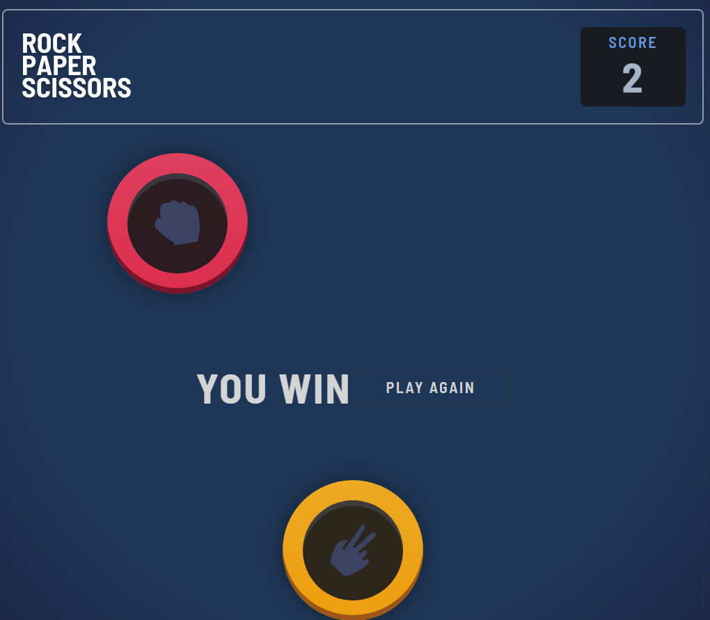

# Frontend Mentor - Rock, Paper, Scissors solution

This is a solution to the [Rock, Paper, Scissors challenge on Frontend Mentor](https://www.frontendmentor.io/challenges/rock-paper-scissors-game-pTgwgvgH). Frontend Mentor challenges help you improve your coding skills by building realistic projects.

## Table of contents

- [Frontend Mentor - Rock, Paper, Scissors solution](#frontend-mentor---rock-paper-scissors-solution)
	- [Table of contents](#table-of-contents)
	- [Overview](#overview)
		- [The challenge](#the-challenge)
		- [Screenshot](#screenshot)
		- [Links](#links)
	- [My process](#my-process)
		- [Built with](#built-with)
		- [What I learned](#what-i-learned)
		- [Continued development](#continued-development)
		- [Useful resources](#useful-resources)
	- [Author](#author)

## Overview

### The challenge

Users should be able to:

-   View the optimal layout for the game depending on their device's screen size
-   Play Rock, Paper, Scissors against the computer
-   Maintain the state of the score after refreshing the browser

### Screenshot




### Links

-   [Solution URL](https://www.frontendmentor.io/solutions/rockpaperscissors-00gVW5ZzPV)
-   [Live Site URL](https://karimabdelghanyhefnawy1.github.io/-Rock-Paper-scissors/)

## My process

### Built with

-   Semantic HTML5 markup
-   CSS custom properties
-   Flexbox
-   CSS Grid
-   Mobile-first workflow
-   A11y & aria Standards
-   BEM
-   Sass
-   Gsap

### What I learned

-   using math random

```js
rockIcon.onclick = function hideRandomButton() {

  let circles1 = document.querySelectorAll(".hero__item--paper, .hero__item--scissors");
  let resultWin1 = document.querySelector(".you-win")
  let resultLose1 = document.querySelector(".you-lose")
  let playAgain1 = document.getElementById("play-again")
  let counterElement = document.querySelector(".h2");

  let randomIndex = Math.floor(Math.random() * circles1.length);
  let circleToHide1 = circles1[randomIndex];

  circleToHide1.style.display = 'none' ;
  triangleImage.style.display = 'none';

  if (circleToHide1 === paperIcon) {
    let currentCount = parseInt(counterElement.textContent);
    let newCount = currentCount + 1;
    counterElement.textContent = newCount;
    resultWin1.style.display = 'block';
    playAgain1.style.display = 'block';
  }else {
    let currentCount = parseInt(counterElement.textContent);
    let newCount = currentCount - 1 ;
    if (newCount < 0) {
      newCount = 0;
    }
    counterElement.textContent = newCount;
    resultLose1.style.display = 'block';
    playAgain1.style.display = 'block';
  }
}
```

### Continued development

-   using the Json file more
-   using React
-   A11y & aria Standards
-   Gsap & gsap ScrollTrigger

### Useful resources

Check out my latest previous articles:

-   [how to make an Indestructible button?](https://dev.to/ymhaah/how-to-make-an-indestructible-button-3f2h)
-   [Top 5 Icon websites for devs and designers!!!](https://dev.to/ymhaah/top-5-icon-websites-for-devs-and-designers-53mh)
-   [30-Day React Learning Journey!](https://dev.to/ymhaah/series/20473)

## Author

-   professional links:
    -   [GitHub](https://github.com/karimabdelghanyhefnawy1)
-   Hire me:
    -   [UpWork](https://www.upwork.com/freelancers/~0127b2bdc888748fe5)
    -   [Freelancer](https://www.freelancer.com/u/karimAbdelghany9)